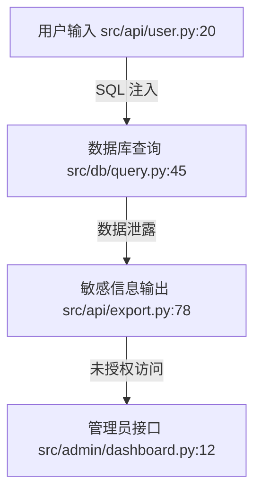

# nano-strix 核心架构设计

## 概述

nano-strix 是一个 LLM 驱动的网络安全渗透测试代理，采用 nanobot（根代理/编排器）+ strix（专用分析代理）的分层架构。

- **使用模式**: 交互式 + 自动化双模式
- **输入**: 代码仓库（静态分析），预留 URL/IP/域名（动态分析）入口
- **输出**: 完整渗透测试报告（漏洞 + 漏洞利用验证 + 修复建议 + 攻击路径图）
- **LLM 角色**: 全自主代理
- **编排方式**: 混合 — nanobot 全局编排，strix 代理按需并行或串行执行
- **LLM 基础设施**: 可插拔接口，支持任意 provider
- **运行时**: 多进程 IPC（每个 strix 代理是独立进程，nanobot 通过 stdin/stdout JSON 协调）
- **架构风格**: 事件驱动 + 共享状态

## 1. 目录结构

```
src/nano_strix/
├── cli.py                 # Click 命令入口
├── orchestrator/
│   ├── runner.py          # 主编排循环
│   ├── planner.py         # LLM 驱动的分析策略规划
│   └── aggregator.py      # 结果汇总 + 报告生成
├── agents/
│   ├── base.py            # BaseAgent IPC 抽象
│   ├── manager.py         # 子 agent 生命周期管理
│   ├── per_file.py        # strix-per-file 启动器
│   ├── cross_file.py      # strix-cross-file 启动器
│   └── exploit.py         # strix-exploit 启动器
├── bus/
│   ├── events.py          # 任务事件数据类
│   └── queue.py           # 任务队列/状态流转
├── llm/
│   ├── adapter.py         # 抽象 LLM 接口
│   ├── anthropic.py       # Claude 实现
│   ├── openai.py          # OpenAI 实现
│   └── local.py           # 本地模型（ollama 等）
├── sandbox/
│   ├── base.py            # Sandbox 抽象基类
│   ├── docker.py          # Docker 容器沙箱
│   ├── process.py         # 本地进程沙箱（轻量级）
│   └── manager.py         # 沙箱生命周期管理
├── tools/
│   ├── base.py            # 工具基类
│   ├── registry.py        # 工具注册表
│   ├── filesystem.py      # 文件系统操作
│   ├── shell.py           # 命令执行
│   └── scanner.py         # pentest 专用工具封装
├── logging/
│   ├── logger.py          # 统一日志接口
│   ├── task_logger.py     # 任务状态日志
│   ├── llm_logger.py      # LLM 调用日志
│   └── tool_logger.py     # 工具调用日志
├── session/
│   ├── manager.py         # 会话管理
│   └── state.py           # 分析状态持久化
├── config/
│   ├── schema.py          # 配置数据类
│   ├── loader.py          # 配置加载
│   └── paths.py           # 路径常量
├── templates/
│   ├── orchestrator.md    # 主 agent system prompt
│   ├── per_file.md        # per-file agent prompt
│   ├── cross_file.md      # cross-file agent prompt
│   └── exploit.md         # exploit agent prompt
├── report/
│   ├── generator.py       # 报告生成器
│   ├── templates/         # 报告模板
│   └── attack_graph.py    # 攻击路径图
└── shared/
    └── models.py          # 共享数据模型
```

## 2. 可配置阶段化 Pipeline

渗透测试任务不是固定流程，而是可配置的阶段化流水线。每个阶段有明确的输入/输出契约。

### 阶段定义

| 阶段 | 输入 | 输出 |
|------|------|------|
| per_file（逐文件分析） | 代码文件列表 | `per_file_findings.json` |
| cross_file（关联分析） | `per_file_findings.json` + 代码文件列表 | `cross_file_findings.json` |
| exploit（漏洞验证） | `findings.json` + 目标环境 | `exploit_results.json` |
| report（报告生成） | 上述任意阶段的输出 | 渗透测试报告 |

### 阶段间数据流

```
per_file ──► per_file_findings.json ──┐
                                      ├──► cross_file ──► cross_file_findings.json ──┐
                                      │                                              │
                                      │    (也可以直接作为输入)                        │
                                      │                                              ▼
                                      └──────────────────────────────────────► exploit ──► exploit_results.json
                                                                                          │
                                                                                          ▼
                                                                                       report
```

### 配置示例

```yaml
# 完整流程
pipeline:
  - per_file
  - cross_file
  - exploit
  - report

# 只做代码分析
pipeline:
  - per_file
  - cross_file
  - report

# 从已有分析结果直接验证
pipeline:
  - exploit        # 输入: 指定已有的 findings.json
  - report
```

### Pipeline 预设

```python
PIPELINE_PRESETS = {
    "full":      ["per_file", "cross_file", "exploit", "report"],
    "analysis":  ["per_file", "cross_file", "report"],
    "exploit":   ["exploit", "report"],
    "quick":     ["per_file", "report"],
}
```

### Task 模型

```python
@dataclass
class PipelineConfig:
    stages: list[str]              # 要执行的阶段列表，按顺序
    input_overrides: dict          # 外部输入（如已有的 findings.json 路径）
    sandbox: SandboxConfig | None  # 沙箱配置（exploit 阶段使用）

@dataclass
class TaskState:
    task_id: str
    pipeline: PipelineConfig       # 阶段配置
    current_stage: str | None      # 当前执行到哪个阶段
    stage_results: dict            # 每个阶段的输出路径
    status: str                    # PENDING / RUNNING / COMPLETED / FAILED
```

## 3. EventBus 与状态机

### 任务状态

```
PENDING → RUNNING → COMPLETED
                  → FAILED
```

简化为 4 个状态，阶段内部的流转由 orchestrator 管理，不暴露为全局状态。

### 事件类型

```python
@dataclass
class TaskEvent:
    task_id: str
    event_type: str        # task_created / task_started / stage_started / stage_completed / task_completed / task_failed
    stage: str | None      # 当前阶段（stage 相关事件时有值）
    payload: dict          # 事件携带的数据
    timestamp: datetime
```

### EventBus 职责

1. **发布/订阅** — orchestrator 发布任务，agents 订阅并执行
2. **状态持久化** — 任务状态写入共享存储，进程间可读
3. **生命周期回调** — 状态变更时触发 hook

## 4. LLM 适配层

### 接口

```python
class LLMProvider(ABC):
    @abstractmethod
    async def chat(
        self,
        messages: list[dict],
        tools: list[dict] | None = None,
        temperature: float = 0.7,
        max_tokens: int = 4096,
    ) -> LLMResponse:
        ...

    @abstractmethod
    async def stream_chat(
        self,
        messages: list[dict],
        tools: list[dict] | None = None,
        temperature: float = 0.7,
        max_tokens: int = 4096,
    ) -> AsyncIterator[str]:
        ...
```

### LLMResponse

```python
@dataclass
class LLMResponse:
    content: str | None
    tool_calls: list[ToolCall]
    finish_reason: str              # stop / tool_calls / error
    usage: dict[str, int]
    model: str
```

### 注册与工厂

```python
# registry.py
PROVIDER_REGISTRY: dict[str, type[LLMProvider]] = {}

def register_provider(name: str):
    def decorator(cls):
        PROVIDER_REGISTRY[name] = cls
        return cls
    return decorator

# factory.py
def create_provider(config: LLMConfig) -> LLMProvider:
    cls = PROVIDER_REGISTRY[config.provider]
    return cls(api_key=config.api_key, base_url=config.base_url, model=config.model)
```

### 各阶段独立配置模型

```yaml
llm:
  default: anthropic
  models:
    orchestrator: claude-sonnet-4-6
    per_file: claude-haiku-4-5-20251001
    cross_file: claude-sonnet-4-6
    exploit: claude-sonnet-4-6
    report: claude-haiku-4-5-20251001
```

## 5. IPC 协议

### 通信方式

stdin/stdout JSON lines，每条消息一行 JSON（`\n` 分隔）。

### 消息类型

| type | 方向 | 用途 |
|------|------|------|
| `task` | orchestrator → agent | 下发任务 |
| `progress` | agent → orchestrator | 进度回报 |
| `result` | agent → orchestrator | 任务完成，返回结果 |
| `error` | agent → orchestrator | 任务失败，返回错误 |
| `cancel` | orchestrator → agent | 中止任务 |

### 生命周期

```
orchestrator                    agent (子进程)
    │                               │
    │──── spawn subprocess ────────►│
    │──── task (stdin) ────────────►│
    │◄─── progress (stdout) ────────│
    │◄─── result (stdout) ──────────│
    │──── close stdin ─────────────►│
    │◄─── exit code ────────────────│
```

### 超时配置

```python
@dataclass
class IPCConfig:
    timeout_seconds: int = 300
    max_retries: int = 2
    retry_delay_seconds: int = 5
```

## 6. 共享工作区

### 结构

```
workspace/
└── {task_id}/
    ├── config.yaml              # 本次任务的 pipeline 配置
    ├── source/                  # 目标代码的副本（快照）
    ├── results/
    │   ├── per_file_findings.json
    │   ├── cross_file_findings.json
    │   └── exploit_results.json
    ├── artifacts/               # PoC 脚本等
    ├── report/
    │   └── report.md
    └── logs/
        ├── task.jsonl           # 任务状态日志
        ├── llm.jsonl            # LLM 调用日志
        ├── tool.jsonl           # 工具调用日志
        ├── sandbox.jsonl        # 沙箱操作日志
        ├── ipc.jsonl            # IPC 通信日志
        └── orchestrator.log     # 人类可读汇总日志
```

### 设计原则

1. **快照优先** — 任务开始时复制目标代码到 `source/`，避免分析过程中代码变化
2. **JSON 标准化** — 各阶段输出统一 JSON 格式
3. **任务隔离** — 每个 task_id 独立目录
4. **可恢复** — 进程崩溃后从 `results/` 目录恢复断点

### Finding 数据格式

```python
@dataclass
class Finding:
    id: str
    title: str
    severity: str                    # critical / high / medium / low / info
    category: str                    # sql_injection / xss / rce / ...
    file_path: str
    line_range: tuple[int, int]
    description: str
    code_snippet: str
    recommendation: str
    confidence: float                # 0-1
    metadata: dict
```

## 7. 沙箱系统

渗透测试 agent 需要对目标代码进行部署和测试，这些操作必须在隔离环境中执行，防止对宿主系统造成影响。

### 沙箱类型

| 类型 | 适用场景 | 隔离级别 |
|------|----------|----------|
| Docker 容器 | exploit 验证、需要部署目标应用 | 高 — 完全隔离的容器环境 |
| 本地进程 | per_file/cross_file 静态分析 | 低 — 仅限制文件系统访问 |

### 接口设计

```python
class Sandbox(ABC):
    @abstractmethod
    async def create(self, config: SandboxConfig) -> SandboxInstance:
        """创建沙箱实例。"""
        ...

    @abstractmethod
    async def execute(self, command: str, timeout: int = 60) -> ExecutionResult:
        """在沙箱内执行命令。"""
        ...

    @abstractmethod
    async def copy_in(self, local_path: str, sandbox_path: str) -> None:
        """将文件复制到沙箱。"""
        ...

    @abstractmethod
    async def copy_out(self, sandbox_path: str, local_path: str) -> None:
        """从沙箱复制文件出来。"""
        ...

    @abstractmethod
    async def destroy(self) -> None:
        """销毁沙箱。"""
        ...

@dataclass
class SandboxConfig:
    sandbox_type: str              # docker / process
    image: str | None              # Docker 镜像（docker 类型时必填）
    network: str = "none"          # 网络策略: none / bridge / host
    memory_limit: str = "512m"     # 内存限制
    cpu_limit: float = 1.0         # CPU 限制
    timeout: int = 600             # 沙箱最大存活时间（秒）
    env_vars: dict = field(default_factory=dict)  # 环境变量
    volumes: list[dict] = field(default_factory=list)  # 挂载卷

@dataclass
class ExecutionResult:
    exit_code: int
    stdout: str
    stderr: str
    duration: float                # 执行耗时（秒）
```

### 各阶段沙箱使用

| 阶段 | 沙箱类型 | 用途 |
|------|----------|------|
| per_file | process | 静态分析工具执行（lint、AST 解析） |
| cross_file | process | 跨文件分析工具执行 |
| exploit | docker | 部署目标应用、运行 PoC、验证漏洞 |
| report | 无 | 仅数据处理，不需要沙箱 |

### exploit 阶段的沙箱流程

```
1. 根据目标代码创建 Docker 容器（自动检测依赖、构建镜像）
2. 将 PoC 脚本复制到容器
3. 在容器内执行 PoC
4. 收集执行结果（stdout/stderr/exit_code）
5. 销毁容器
```

orchestrator 通过 IPC 协议下发沙箱配置，agent 进程内部调用 Sandbox 接口操作。

## 8. 日志系统

任务执行过程中需要详细记录所有关键操作，用于调试、审计和报告附录。

### 日志类别

| 类别 | 记录内容 | 用途 |
|------|----------|------|
| task | 任务状态变更、阶段流转、开始/结束时间 | 任务追踪、断点恢复 |
| llm | 模型名、prompt、response、token 用量、延迟 | 成本分析、调试、复现 |
| tool | 工具名、输入参数、执行结果、耗时 | 工具调试、审计 |
| sandbox | 沙箱创建/销毁、命令执行、文件复制 | 安全审计 |
| ipc | 进程间消息收发、序列化/反序列化 | 通信调试 |

### 日志结构

```python
@dataclass
class LogEntry:
    timestamp: datetime
    task_id: str
    stage: str | None
    category: str                  # task / llm / tool / sandbox / ipc
    level: str                     # debug / info / warning / error
    event: str                     # 具体事件名
    data: dict                     # 事件数据
    duration: float | None         # 耗时（如有）
```

### LLM 调用日志示例

```json
{
  "timestamp": "2026-05-18T10:30:15Z",
  "task_id": "t-001",
  "stage": "per_file",
  "category": "llm",
  "level": "info",
  "event": "chat_request",
  "data": {
    "model": "claude-sonnet-4-6",
    "messages_count": 5,
    "tools_count": 3,
    "input_tokens": 2048,
    "output_tokens": 512,
    "latency_ms": 1200,
    "finish_reason": "tool_calls"
  }
}
```

### 工具调用日志示例

```json
{
  "timestamp": "2026-05-18T10:30:16Z",
  "task_id": "t-001",
  "stage": "per_file",
  "category": "tool",
  "level": "info",
  "event": "tool_execution",
  "data": {
    "tool": "read_file",
    "arguments": {"path": "src/auth.py"},
    "result_chars": 1523,
    "duration_ms": 5
  }
}
```

### 日志输出

```
workspace/{task_id}/logs/
├── task.jsonl           # 任务状态日志
├── llm.jsonl            # LLM 调用日志
├── tool.jsonl           # 工具调用日志
├── sandbox.jsonl        # 沙箱操作日志
├── ipc.jsonl            # IPC 通信日志
└── orchestrator.log     # 人类可读的汇总日志
```

- JSONL 格式（每行一条 JSON）用于程序解析
- `orchestrator.log` 是人类可读的文本格式，用于终端输出和快速查看
- 日志文件按类别分离，便于按需查看和分析
- 报告生成时可引用日志数据作为附录（执行时间线）

### 日志级别配置

```yaml
logging:
  level: info                    # 全局默认级别
  categories:
    llm: debug                   # LLM 调用记录完整 prompt/response
    tool: info                   # 工具调用记录参数和结果
    sandbox: info                # 沙箱操作
    ipc: warning                 # IPC 仅记录异常
```

## 9. CLI 接口

### 命令结构

```bash
nano-strix
├── run                  # 执行渗透测试
│   --target PATH        # 目标代码目录
│   --pipeline PIPELINE  # 预设流水线 或 自定义阶段列表
│   --input KEY=PATH     # 外部输入覆盖
│   --config PATH        # 自定义配置文件
│   --model MODEL        # 覆盖默认模型
│   --output DIR         # 输出目录
│   --verbose            # 详细日志
│   --no-snapshot        # 不复制源码，直接分析原目录
│
├── resume TASK_ID       # 从断点恢复
├── report TASK_ID       # 重新生成报告
│   --format FORMAT      # markdown / html / pdf
├── config               # 配置管理
│   ├── show
│   ├── set KEY VALUE
│   └── init
└── version
```

### 交互模式

```
$ nano-strix run

? 目标代码目录: ./my-project
? 选择流水线:
  > 完整分析（per-file → cross-file → exploit → report）
    仅代码分析（per-file → cross-file → report）
    仅漏洞验证（需要已有分析结果）
    自定义

? 确认执行? (Y/n)
```

## 10. 报告生成

### 报告结构

1. 执行摘要 — 发现统计、风险评级、关键建议
2. 漏洞详情 — 按严重程度排序，含代码片段、复现步骤、修复建议
3. 攻击路径图 — Mermaid 格式，展示漏洞关联和攻击链
4. 修复建议汇总 — 按优先级排序
5. 附录 — 完整 findings JSON、工具版本、执行时间线

### 输出格式

| 格式 | 实现方式 |
|------|----------|
| Markdown | 默认输出 |
| HTML | Markdown → HTML（Jinja2 模板） |
| PDF | HTML → PDF（weasyprint） |

### 攻击路径图示例


